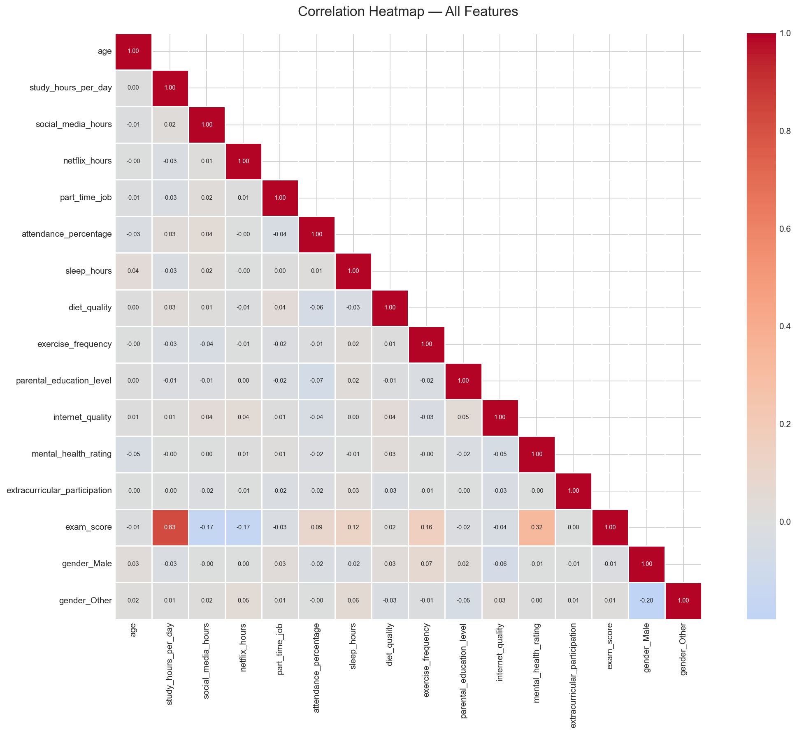
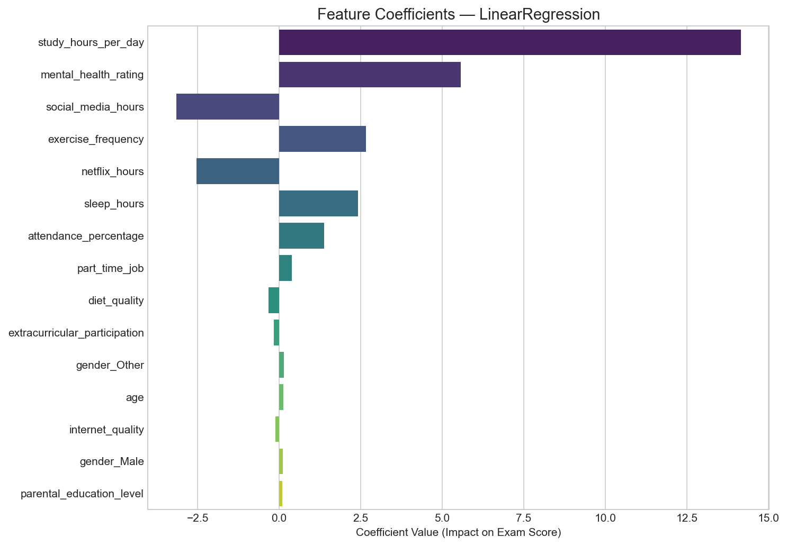

# FlutterApp – Student Exam Score Predictor

## Mission & Problem Description

Develop a machine learning pipeline that predicts a university student's final exam score using daily habits and lifestyle data. The system uses Linear Regression to estimate academic performance based on factors such as study time, sleep, and attendance. Its goal is to provide students with predictions that help them improve their performance before exams.

---

### Dataset: Student Habits vs Academic Performance

This project uses the **Student Habits vs Academic Performance** dataset, which contains academic, behavioral, and lifestyle information collected from approximately **1,000 university students**. The dataset includes both numerical and categorical features, making it suitable for training a Linear Regression model to predict final exam scores.

- **Source:** https://www.kaggle.com/datasets/jayaantanaath/student-habits-vs-academic-performance
- **File:** `student_habits_performance.csv`
- **Records:** ~1,000 students
- **Features:** 15 (8 numerical, 7 categorical)
- **Target Variable:** `exam_score`

# Exploratory Data Analysis (EDA)

Before training the Linear Regression model, exploratory data analysis was performed to better understand relationships within the dataset.

## Correlation Heatmap

The correlation heatmap illustrates the strength and direction of relationships between variables. Features with stronger correlations to the target variable (`exam_score`) were particularly useful during model training.



---

## Feature Distributions

The distribution plots below show how important numerical variables are spread across the dataset. Understanding these distributions helps identify skewness, outliers, and potential preprocessing requirements before model training.




## Live API & Swagger UI

The deployed API documentation is available through Swagger UI:

**Swagger UI:**  
https://student-predictor-api-9ds9.onrender.com/docs

To test the API:

1. Open the Swagger UI link above.
2. Expand the **POST `/api/v1/predict`** endpoint.
3. Click **Try it out**.
4. Enter a valid JSON request body.
5. Click **Execute** to receive a real-time prediction.

---

## Video Demonstration

Watch the deployment and application walkthrough:

**YouTube Demo:**  
▶️ https://www.youtube.com/watch?v=OyUq7xkeKuM

---

# Running the Mobile App

## Prerequisites

Before running the application, ensure you have:

- Flutter SDK installed
- Android Studio with an Android Emulator, or
- A physical Android device connected via USB with **USB Debugging** enabled

---

## Installation

Clone the repository and navigate to the Flutter project:

```bash
cd summative/academiq
```

Install all required dependencies:

```bash
flutter pub get
```

---

## Run the Application

Ensure your Android emulator is running or your physical device is connected.

Then execute:

```bash
flutter run
```

---

## Using the App

1. Launch the AcademIQ application.
2. Complete the student lifestyle and study habits form.
3. Tap **Predict My Score**.
4. The app sends the data to the deployed FastAPI server.
5. The trained Linear Regression model returns the predicted final exam score, which is displayed instantly in the app.

---

## Tech Stack

### Mobile
- Flutter
- Dart

### Backend
- FastAPI
- Uvicorn

### Machine Learning
- Scikit-learn
- Linear Regression
- Pandas
- NumPy

### Deployment
- Render

### API Documentation
- Swagger UI (OpenAPI)